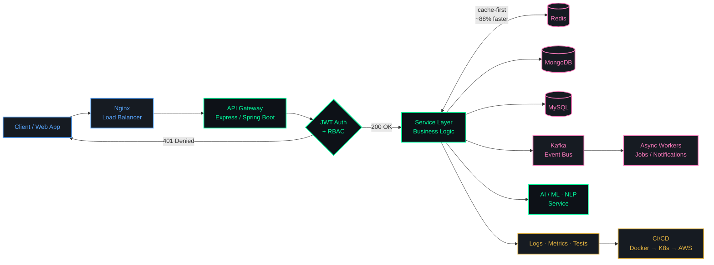

<!--
==================================================================
  AKSHAT AGARWAL — GITHUB PROFILE README
  Theme .......... "Backend Terminal" + Linux/TTY
                   (dark #0D1117 + neon #00FF9F)
  Rename to ...... README.md  (repo: terror-akshat/terror-akshat)
  Notes:
    - No inline CSS `style=""` is used, GitHub strips it.
    - The neofetch / crontab / apt blocks use ```console fences.
      The Tux ASCII art is padded to a fixed 18-char column with
      PLAIN SPACES — do not reformat or let an editor convert
      those spaces to tabs, or the art will shear apart.
    - shields.io `logo=` slugs come from simple-icons. Verified
      valid: linux, ubuntu, debian, archlinux, gnubash, gnu,
      nginx, redhat, kalilinux, vim. NOT valid (badge still
      returns HTTP 200 but silently renders with NO icon):
      systemd, openssh.
    - !! NEVER put "&" (%26) in capsule-render's text= or desc=.
      capsule-render injects it RAW into the SVG, which makes the
      SVG invalid XML, and the browser then refuses to draw the
      image (silent broken header). Use "|" (%7C) or the word
      "and" instead. readme-typing-svg DOES escape &, so %26 is
      safe there.
    - Mermaid diagram renders natively on GitHub.
    - If github-readme-stats ever shows 503, it is the public
      instance rate-limit. Self-host it on Vercel and swap the
      domain to make it 100% reliable.
==================================================================
-->

<div align="center">


<br/>


<br/><br/>

<code>Building scalable systems</code> •
<code>Writing clean APIs</code> •
<code>Exploring AI</code> •
<code>Automating everything</code>

</div>

---

## 🐧 `~/` whoami

```console
akshat@backend-lab:~$ neofetch

        .--.      akshat@backend-lab
       |o_o |     ────────────────────────────────────────────
       |:_/ |     User ······· Akshat Agarwal
      //   \ \    Role ······· Backend Engineer · Full Stack Developer
     (|     | )   OS ········· Linux (Ubuntu · Debian)
    /'\_   _/`\   Host ······· PSIT Kanpur · B.Tech CSE (AI) · CGPA 8.44
    \___)=(___/   Kernel ····· Node.js · Express · Spring Boot
                  Shell ······ bash · zsh
                  WM ········· Docker · Kubernetes · Nginx
                  Packages ··· 700+ DSA solved (LeetCode)
                  CPU ········ DSA · System Design · Backend Architecture
                  Memory ····· MongoDB · MySQL · Redis · Kafka
                  Uptime ····· Always Learning, Always Building
                  Region ····· India
                  Locale ····· en_IN.UTF-8

                  ███ ███ ███ ███ ███ ███ ███ ███

akshat@backend-lab:~$ cat stack.env

  RUNTIME=node,express,spring-boot,next
  DATASTORE=mongodb,mysql,redis
  BROKER=kafka
  INFRA=docker,kubernetes,nginx,aws,linux
  PIPELINE=github-actions,ci-cd
  STATUS=open_to_collaboration

akshat@backend-lab:~$ uname -srm
Linux 6.x.x-backend x86_64

akshat@backend-lab:~$ █
```

<p align="center">
  
  
  
  
  
  
</p>

### Service Manifest

```yaml
identity:
  name: Akshat Agarwal
  role: Backend / Full-Stack Engineer
  location: India

education:
  degree: B.Tech in Computer Science (AI)
  institute: PSIT Kanpur
  cgpa: 8.44

engineering:
  builds: full-stack systems using Next.js, Node.js, MongoDB
  deploys: Docker, AWS, CI/CD pipelines for scalable deployments
  explores: AI/ML & NLP with a focus on real-world applications
  foundation: [ DSA, System Design, Backend Architecture ]

proof_of_work:
  dsa_solved: 700+ problems on LeetCode
  open_to: [ open-source collaboration, impactful engineering projects ]

contact:
  email: akshat.agarwal9292@gmail.com
  ask_me_about: [ MERN, DevOps, APIs, Databases, AI/NLP ]
```

---

## 🧑‍💻 About Me

- 🎓 **B.Tech in Computer Science (AI)** | CGPA **8.44** | PSIT Kanpur
- 🛠 Engineering **full-stack systems** using **Next.js, Node.js, MongoDB**
- ⚙️ Actively working with **Docker, AWS, CI/CD pipelines** for scalable deployments
- 🤖 Exploring **AI/ML & NLP** with a focus on real-world applications
- 🧩 Strong foundation in **DSA, System Design & Backend Architecture**
- 🧠 Solved **700+ DSA problems** on **LeetCode** → [Profile](https://leetcode.com/u/Akshat_CSAI/)
- 🤝 Open to **open-source collaboration & impactful engineering projects**
- 💬 Ask me about **MERN, DevOps, APIs, Databases, AI/NLP**
- 📫 **Reach me:** `akshat.agarwal9292@gmail.com`

### ⏱️ Scheduled jobs

```console
akshat@backend-lab:~$ crontab -l

# min  hour  dom  mon  dow    command
   0     9    *    *   1-5    /usr/bin/build --apis --scalable --clean
   0    14    *    *   1-5    /usr/bin/debug --stack-trace --with-coffee
  30    20    *    *    *     /usr/bin/leetcode solve --keep-streak
   0    22    *    *   6,0    /usr/bin/explore --ai --ml --nlp
*/15     *    *    *    *     /usr/bin/git commit -m "ship it, scale it"
  @reboot                     /usr/bin/systemctl start always-learning
```

---

## 🏗️ How I Architect a System

> [!NOTE]
> A typical request lifecycle through the services I design — gateway, auth, cache-first reads, async event fan-out, and observability.



---

<h1 align="center">🧠 Skill Set</h1>

<p align="center">
  
</p>

<div align="center">

<table>
  <tr>
    <td align="center" width="180"><b>⚙️<br/>Backend &amp; APIs</b></td>
    <td>
      <br/>
      <sub><code>Node.js</code> <code>Express</code> <code>SpringBoot</code> <code>graphQL</code> <code>REST APIs</code> <code>JWT Auth</code></sub>
    </td>
  </tr>
  <tr>
    <td align="center"><b>🗄️<br/>Data &amp; Messaging</b></td>
    <td>
      <br/>
      <sub><code>MongoDB</code> <code>MySQL</code> <code>Redis</code> <code>Kafka</code></sub>
    </td>
  </tr>
  <tr>
    <td align="center"><b>🐳<br/>DevOps &amp; Cloud</b></td>
    <td>
      <br/>
      <sub><code>Docker</code> <code>Kubernetes</code> <code>Nginx</code> <code>Linux</code> <code>Render</code> <code>Netlify</code> <code>Vercel</code></sub>
    </td>
  </tr>
  <tr>
    <td align="center"><b>💻<br/>Languages</b></td>
    <td>
      <br/>
      <sub><code>Python</code> <code>Java</code> <code>JavaScript</code> <code>TypeScript</code></sub>
    </td>
  </tr>
  <tr>
    <td align="center"><b>🎨<br/>Frontend</b></td>
    <td>
      <br/>
      <sub><code>React</code> <code>Next.js</code> <code>Tailwind</code> <code>Bootstrap</code></sub>
    </td>
  </tr>
  <tr>
    <td align="center"><b>🧰<br/>Tooling</b></td>
    <td>
      <br/>
      <sub><code>Git</code> <code>GitHub</code> <code>NPM</code> <code>VS Code</code> <code>Postman</code></sub>
    </td>
  </tr>
</table>

</div>

---

## 🚀 Featured Projects

<p align="center">
  
</p>

```bash
└─$ docker ps --format "table {{.NAMES}}\t{{.STATUS}}"
```

| # | Service | Description | Tech Stack | Status |
|:--:|---------|-------------|------------|:------:|
| `01` | 🏥 **Hospital Management System** | Automated OPD/IPD, ward management, and lab reports with secure role-based access. Integrated **Redis caching** to speed up API responses by **~88%**. | `React` `Node.js` `Express` `MongoDB Atlas` `Redis` `Jest` |  |
| `02` | 🎨 **Vision Board** | Real-time collaborative whiteboard + WebRTC video chat; **sub-100ms latency**. | `WebRTC` `WebSocket` `React` `Node.js` |  |
| `03` | ✈️ **Journey Junction** | Travel booking platform with animations and search optimization. | `HTML` `CSS` `JavaScript` |  |

> [!TIP]
> **Backend wins worth noting:** `~88%` faster API responses via Redis caching · `<100ms` real-time WebRTC latency · role-based access control baked in at the API layer.

🔗 Explore more in my [pinned repositories](https://github.com/terror-akshat?tab=repositories)!

---

## 🏆 Achievements

<p align="center">
  
</p>

<p align="center">
  
  
  
  
  
</p>

- ⭐ **5-Star in DSA** on [HackerRank](https://www.hackerrank.com/profile/csai__1520018)
- ⭐ **4-Star in Java**
- 📜 **AWS Cloud Practitioner Certified**
- ✅ **Certified** in Python & Frontend Libraries (FreeCodeCamp)

---

## 📊 Dynamic GitHub & Coding Stats

```bash
└─$ systemctl status akshat.metrics --live
```

<p align="center">
  
  
</p>

<p align="center">
  
  
</p>

<h3 align="center">📈 Contribution Heatmap</h3>

<p align="center">
  
</p>

---

## 🤝 Connect with Me

```console
akshat@backend-lab:~$ sudo apt install akshat

Reading package lists... Done
Building dependency tree... Done
Reading state information... Done

The following NEW packages will be installed:
  akshat  backend-engineer  devops-enthusiast  ai-explorer

Suggested packages:
  open-source-collaboration  impactful-engineering-projects

0 upgraded, 4 newly installed, 0 to remove.
After this operation, 700+ problems will have been solved.
Do you want to continue? [Y/n] y

Setting up akshat (2026.backend) ...
✔ Ready to collaborate.
```

```http
GET /api/v1/akshat/contact HTTP/1.1
Host: github.com
Accept: application/json

HTTP/1.1 200 OK
Content-Type: application/json
X-Response-Time: 12ms
```

```json
{
  "email": "akshat.agarwal9292@gmail.com",
  "linkedin": "akshat-agarwal-55946a27a",
  "leetcode": "Akshat_CSAI",
  "github": "terror-akshat",
  "open_to": ["open-source collaboration", "impactful engineering projects"]
}
```

<p align="center">
  <a href="https://linkedin.com/in/akshat-agarwal-55946a27a" target="_blank"></a>
  <a href="mailto:akshat.agarwal9292@gmail.com"></a>
  <a href="https://leetcode.com/u/Akshat_CSAI/"></a>
  <a href="https://github.com/terror-akshat"></a>
  <a href="https://www.hackerrank.com/profile/csai__1520018"></a>
</p>

---

<div align="center">


</div>
